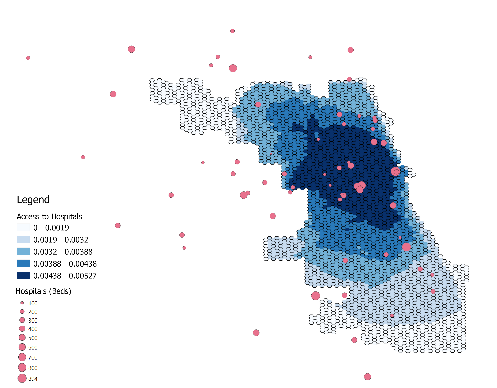

**Introduction**

There is a need to better understand accessibility to hospitals for COVID-19 treatment. Kang et al. (2020) have recognized this need 
and have created code that rapidly measures spatial accessibility to ICU beds and ventilators in Illinois. 
This published code can be used by other researchers and provide a sample to be applied to other areas and perhaps other contexts altogether. 
In this study, we analyze the published Python code in a Jupyter notebook and attempt to reproduce the study. The code analyzes access in Chicago to 
decrease data processing time. This reproduction allowed us to study the code step-by-step to identify sources of uncertainty and provide recommendations for 
Kang et al. to improve reproducibility and thus replicability for other contexts. 

 
**Materials and Methods**

In this study, we reproduced the methods of Kang et al. (2020), which studied 
ICU bed and ventilator accessibility in Illinois as a means to measure COVID-19 treatment access. 
We used a Python script in a [Jupyter notebook](https://github.com/mtango99/RP-Kang/blob/main/COVID-19Acc.ipynb) focusing on the Chicago area, published by Kang et al.

The study uses four datasets: hospitals (with number of ICU beds and ventilators), 
COVID-19 confirmed case dataset, residential dataset (tracts), and a road network 
dataset. Hospital and confirmed case datasets were provided by IDPH. The residential 
dataset was obtained from the United States Census Bureau. The road network dataset 
was from OpenStreetMap and obtained using Python package OSMnx. 

A parallel enhanced two-step floating catchment area method (P-E2SFCA) method 
was used to identify areas with ICU bed and ventilator access within a 10, 20, and 30 minute drive. 

In their Python script, Kang et al. cleaned up road networks, set roads without a reported speed 
limit at 35 mph, identified a nearest node (where two streets cross) for each hospital, and 
estimated centroids of each census tract to calculate catchment areas for each hospital. 
Catchment areas were formed by creating convex hulls from tract centroids. 

Accessibility measures were then aggregated into a hexagon grid and normalized, taking into account 
catchment overlap as areas with higher accessibility. 

 
The data section of in the RP-Kang respository was not clearly laid out, so I created "raw" and "derived" folders in the data folder to reorganize the data. I then changed 
the code in the Jupyter notebook to reflect these changes. I also created a figure that reflects the number of ICU beds in each hospital via point size to better understand 
the spatial distribution of ICU beds in Chicago. In the figures created by Kang et al., each hospital point was the same size. Instead of using red to represent accessibility, 
I used blue because red is often associated with an undesirable characteristic. 

 
**Results and Discussion**

Because Kang et al. limited their road network to Chicago itself and hospitals were associated with the nearest street network node, for analytical purposes there were 
many hospitals at the edge of the city. We therefore added a buffer of 15 miles (24140.2 m) to Chicago to extend the street network. There were a few streets with invalid 
speed limit entries, so we implemented Maja Cannavo's idea and code using "try" and "except" commands to replace invalid speed limits with 35 mph. 

***ADD MAP & THEIR RESULTSSSSSSSSSSSSSSSSSSSS HERE***

I created a sample map (Figure 1) of Chicago hospitals and accessibility using a better color ramp and including ICU bed numbers in the visualization. 
I used the Chicago accessibility data (ACC_Chicago_2018_ZIP_POP) in the raw data folder in the RP-Kang repository, using a color gradient from white to blue. This color ramp was chosen because Kang et al. 
had used a white to red color ramp to describe less to more hospital accessibility, which was confusing because red typically represents something undesirable. 
This color ramp was applied to the field 'value', which I am assuming represents accessibility. The authors did not specify if they took into account ICU beds or ventilators 
(the Jupyter notebook code gave the option to use either) as well so my figure may be inaccurate and primarily serves as a template for future figures that visualize ICU bed 
or ventilator distribution across space, as the authors originally did not change the size of the circles representing hospitals. The repository used for 
this analysis can be found at [https://github.com/mtango99/RP-Kang](https://github.com/mtango99/RP-Kang). 

[Figure 1.](assets/hospitalAccess.png) Map showing access to ICU beds in Chicago. Hospital point size corresponds to number of ICU beds. Blue represents more access. 

It would have been helpful if Kang et al. had added more details about what the two maps at the top of the Jupyter notebook represent. 
What units are the scale in? Is it showing ICU beds or ventilators? 

Unfortunately, the catchments took so long to load in the Jupyter notebook that it was difficult to play around 
with the script to test how the code changed the final figure. If possible, I would recommend 
that Kang et al. find a way to speed up this process to increase accessibility. 
While having the code accessible does make measuring spatial accessibility more rapid, 
there could still be improvements. 

After changing the structure of the repository to include "raw" and "derived" data folders, I was unable to push to or pull from GitHub through the Jupyter terminal. I therefore 
had to download and manually upload the Jupyter notebook to my repository. There should ideally be a pre-made script that pushes to and pulls from GitHub from the Jupyter terminal. 

Another future change to the script should include commands to save each figure to the repository. 

Kang et al. also preprocess their hospital data outside of the given code; it would be helpful to have a separate script published so other researchers can change how 
hospitals are preprocessed. 

 
**Conclusions**

Overall, the methods by Kang et al. (2020) are useful in gaining a general idea of COVID-19 treatment accessibility. In reality, there are many other forces that shape 
accessibility. The most important of these is lack of access to a car-- particularly in a city like Chicago that has public transportation. Moreover, the weights used 
for each travel time (10, 20, and 30 minutes) to quantify accessibility were not justified except by citing 
[Luo & Qi 2009](https://pubmed.ncbi.nlm.nih.gov/19576837/). Dependence of this analysis on potentially arbitrary weights adds uncertainty to the final accessibility calculations. 
It would also have been more accurate to use area-weighted reaggregation when aggregating to the hexagon grid, as opposed to taking whichever value accounted for more area within 
a given hexagon. 

With sources of uncertainty both within the analysis and in the way it is applied to the real world (construct validity) without accounting for other accessibility measures, 
it is important to not use the results of Kang et al. (2020) as a completely accurate representation of reality. However, it does give a relatively good sense of access and 
serves as a valuable framework for future accessibility studies. Given the code is open-source, it provides valuable tools to researchers who may want to do a similar analysis quickly or build on and improve the methods of Kang et al., as we did. 

 
**Acknowledgements**

Thanks to Steven Montilla-Morantes for the idea to make a new figure with circles correlating to the number of hospital beds, and for helping me brainstorm how to make the figure itself. 
Thanks to Alitzel Villanueva's help as we thought through the Covid Accessibility Jupyter Notebook to better understand Kang et al.'s methods. 
Thanks to Maja Cannavo for bringing up the point about lack of access to cars, area-weighted reaggregation, and for figuring out how to fix the invalid speed limit error. 
Thanks to Professor Joe Holler for guiding us through understanding the methods of Kang et al. (2020) and its sources of uncertainty. 