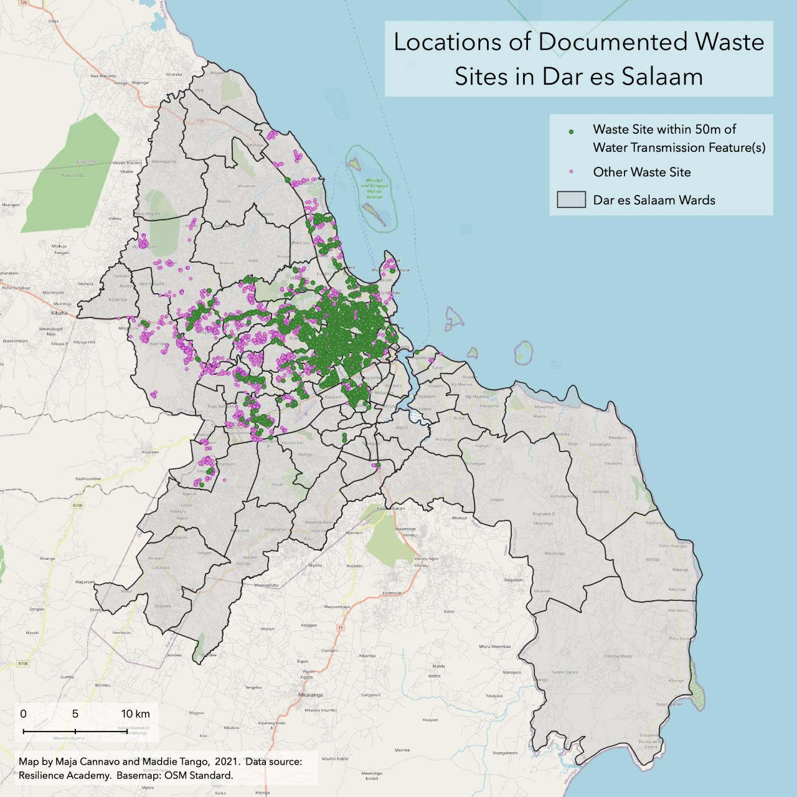

 
***QUESTION***

How does environmental risk and vulnerability due to placement of waste sites near water features vary across the wards of Dar es Salaam? 

 
***ABSTRACT***

Placement of solid waste sites near water transmission features such as rivers, streams, canals, drains, and ditches can lead to flooding during rain events if these waste collections block water transmission and egress. Not only can this result in flooding, but it can also lead to increased contact between humans and pathogens, toxins, and other environmental hazards. In this analysis we identify waste collection sites within 50 meters of water transmission features as potentially dangerous waste sites and calculate the density of dangerous waste sites for each ward in Dar es Salaam to identify spatial distribution of environmental vulnerability.

 

You can view a Leaflet map [here](assets/), clicking on wards to investigate ward names, area in km^2, number of waste sites in the ward, and density of waste sites.

[Figure 1.](assets/dsm_staticmap.jpg) Map of wards, waterway transmission features, and waste sites within 50 m of waterway transmission features. 
Color of wards indicates density of waste sites within 50 m of waterway transmission features per ward. 

 

[Figure 2.](assets/dsm_staticmap.jpg) Map showing all waste sites, differentiated by whether or not they were within 50 meters of a waterway transmission feature. 

 
***METHODS***

Select relevant waterway features (drains, ditches, streams, rivers, and canals) from planet_osm_line layer

`create table waterway_lines as
select osm_id, waterway, way from planet_osm_line
where waterway = 'drain' or waterway = 'ditch' or waterway = 'stream' or waterway = 'river' or waterway = 'canal';`

Transform geometry field of our waterway_lines table to EPSG:32737

`create table waterway_lines_geom as
select osm_id, waterway, st_transform(way,32737)::geometry(linestring,32737) as geom
from waterway_lines;`

Create 50m buffers around the water features--this will be the area where we look for dangerous waste sites

`create table buffers_50m as
select osm_id, waterway, st_multi(st_buffer(geom, 50))::geometry(multipolygon,32737) as geom from waterway_lines_geom;`

Dissolve the buffers

`create table buffers_50m_dissolve as
select st_union(geom)::geometry(multipolygon,32737) as geom
from buffers_50m;`

Convert dissolved buffers to singlepart geometries

`create table singlepart_buffers as
select (st_dump(geom)).geom::geometry(polygon,32737) from buffers_50m_dissolve;`

Import waste sites with EPSG:32737
 

Select all waste sites that intersect the buffers

`create table wastesites_in_zones as
select wastesites.*
from wastesites inner join singlepart_buffers
on st_intersects(wastesites.geom, singlepart_buffers.geom);`

Join ward names to waste sites based on location

`create table wastesites_with_wardnames as
select wastesites_in_zones.*, wards.ward_name
from wastesites_in_zones inner join wards
on st_intersects(wastesites_in_zones.geom, wards.utmgeom);`

Group waste sites by ward 

`create table countedwastesites_byward as
select count(id) as countwastesites, ward_name
from wastesites_with_wardnames group by ward_name;`

Add area field (in km^2) to wards table

`alter table wards add column area_km2 real;
update wards set area_km2 = st_area(utmgeom)/1000000;`

Join count of waste sites back to wards table

`create table wards_with_count as
select wards.*, countedwastesites_byward.countwastesites
from wards left join countedwastesites_byward
on wards.ward_name = countedwastesites_byward.ward_name;`

Replace null waste site count values with 0 

`update wards_with_count
set countwastesites = 0
where countwastesites is null;`

Calculate dangerous waste site density

`alter table wards_with_count add column danger_ws_density real;
update wards_with_count set danger_ws_density = countwastesites / area_km2;`

 
***RESULTS***

Waste sites within 50 meters of waterways tended to be clustered in the center of the city. It is difficult to tell whether this is because waste sites were more likely to be included in 
the layer if within the city due to data collection bias, or if there were indeed more waste sites in the center of the city. 

4947 out of 9628 waste sites were within 50 meters of waterways. Many waterways converge in the center of the city, so it makes sense there would be so many within those buffers. 
However, it is also possible that in collecting data, observers walked along waterways, or perhaps people tend to put  

But data could be based on how they took it

There are many wards with no waste sites. While a few are because the waste sites were not within 50 meters of waterway transmission features, 
in the original waste site layer the waste sites are mostly in the wards that ended up having a greater-than-0 waste site density. 
Thus, it is important to acknowledge that the data collection of the waste sites themselves was limited to particular areas, and the 
lack of waste sites in particular wards may not be representative of reality.

 

***DATA SOURCES***

(Open Street Map)[https://www.openstreetmap.org/] is a public database, editable by anyone with access to it. For data in Dar es Salaam, local university students tend to be the ones editing and updating.

(Resilience Academy)[https://resilienceacademy.ac.tz/] is a Dar es Salaam-based program aimed to equipping students with GIS tools necessary to analyze local challenges and urban resilience (e.g. flood risk). 

 

***DATA LAYERS***

`planet_osm_line`: Open Street Map, imported by [Joe Holler](https://gis4dev.github.io)

`wards`: Resilience Academy, [Dar es Salaam Administrative Wards](https://geonode.resilienceacademy.ac.tz/layers/geonode_data:geonode:dar_es_salaam_administrative_wards) 

`wastesites`: Resilience Academy, [Dar es Salaam Trash Data](https://geonode.resilienceacademy.ac.tz/layers/geonode_data:geonode:dar_es_salaam_trash_data)

 

***ACKNOWLEDGEMENTS***

Thanks to Maja Cannavo, who was an equal contributor to this project.  Thanks also to Professor Joseph Holler for helping us develop this project idea. 
