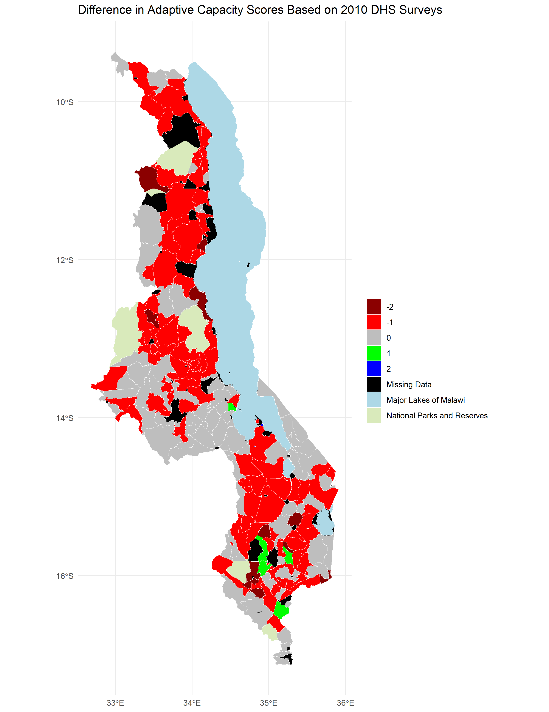
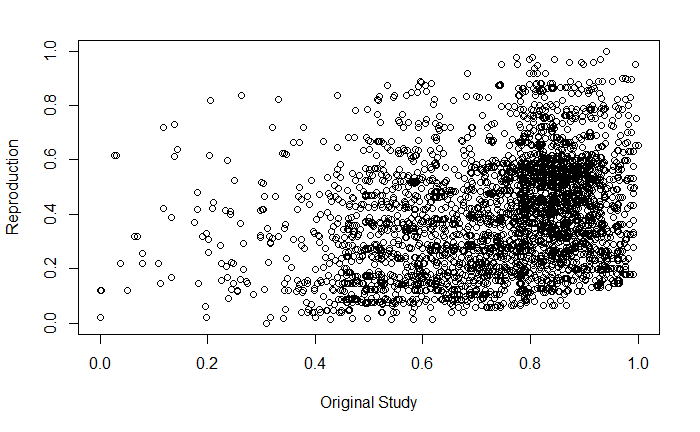

**Replication of:**
# Vulnerability modeling for sub-Saharan Africa

Original study *by* Malcomb, D. W., E. A. Weaver, and A. R. Krakowka. 2014. Vulnerability modeling for sub-Saharan Africa: An operationalized approach in Malawi. *Applied Geography* 48:17–30. DOI:[10.1016/j.apgeog.2014.01.004](https://doi.org/10.1016/j.apgeog.2014.01.004)

Replication Authors:
Madeleine Tango, Joseph Holler, Kufre Udoh, Open Source GIScience students of fall 2019 and Spring 2021

Replication Materials Available at: [mtango99.github.io/malcomb](mtango99.github.io/malcomb)

Created: `23 April 2021`
Revised: `26 April 2021`

## Abstract 

The original study is a multi-criteria analysis of vulnerability to Climate Change in Malawi, and is one of the earliest sub-national geographic models of climate change vulnerability for an African country. The study aims to be replicable, and had 40 citations in Google Scholar as of April 8, 2021. 

## Original Study Information

The study region is the country of Malawi. The spatial support of input data includes DHS survey points, Traditional Authority boundaries, and raster grids of flood risk (0.833 degree resolution) and drought exposure (0.416 degree resolution). 

The original study was published without data or code, but has detailed narrative description of the methodology. The methods used are feasible for undergraduate students to implement following completion of one introductory GIS course. The study states that its data is available for replication in 23 African countries.

### Data Description and Variables

This study used a variety of variables to determine vulnerability. Demographic and Helath Survey (DHS) 
data (with GPS) was used to create an **adaptive capacity** layer, which included 
assets (livestock units, arable land, number of those sick in household in past 
12 months, wealth index score, and number of orphans in household) and access (time 
to water source, has electricity, type of cooking fuel, sex of head of household, 
owns a cell phone, owns a radio, and urban/rural). Household data from DHS was aggregated to DHA clusters and then joined to traditional authorities. 
**Livelihood sensitivity** data came from 
interviews with the Malawi Vulnerability Assessment Committee, as well as data they created 
with the Famine Early Warning System Netowrk and the US Agency for International Development. 
Livelihood sensitivity variables include food from own farm (less vulnerability), 
income from wage labor (less vulnerability), income from cash crops (more vulnerability), 
and disaster coping strategies (looking specifically at environmentally harmful practices, 
which cause vulnerability). To calculate livelihood sensitivity variables, we created a 
[spreadsheet](https://github.com/mtango99/RP-Malcomb/blob/main/data/derived/public/livelihoodData.csv) 
using the "poor" data from the Malawi Vulnerability Assessment Committee. 
For food from own farm, we divided income from cash crops by total income. 
For income from wage labor, we divided income from wage labor by total income. 
For income from cash crops, we divided income from cash crops by total income. 
For disaster coping strategy, we looked for potentially ecologically harmful 
practices, including firewood, wild food, and grass sales. We added up income from these 
practices and divided by total income. 
All of these were converted to percentages by multiplying by 100. 
A **physical exposure** layer included data from UNEP Global Resource Information
Database (GRID)-Europe with variables of estimated risk for flood hazard and exposition to drought events. 

All vulnerability variables were normalized on a scale from of 1-5. Malcomb et al. (2014) had reported 
normalizing on a scale from 0-5 (6 categories), but also stated they used quintiles (5 categories). We used quintiles on a scale of 1-5. 

According to Malcomb et al. (2014), "metathemes" (adaptive capacity, livelihood 
sensitivity, and physical exposure) and individual vulnerability variables were decided based 
on interviews with government, non-government, and development officials, as well as focus group 
interviews with villagers. Then, depending on how much Malcomb et al. (2014) thought each variable would contribute 
to vulnerability, based on their interviews with "experts," each variable was given 
particular weights (Table 1) and combined to create a vulnerability index. 
After the original normalization from 1-5, 
adaptive capacity scores were weighted and then normalized on a range of 0-20 in our 
reproduction, making the numbers similar to those in the resilience figures in Malcomb et al. (2014), 
but it was unclear how exactly they were normalized in the original paper. 

The overall vulnerability score was calculated after normalizing by weighting and adding each metatheme raster together. 

Traditional authority boundary vector layers were downloaded from DHS. 
Livelihood zones were downloaded from USAID/FEWSNET and the "MWI_adm2" layer was used. 
See the [metadata folder](https://github.com/mtango99/RP-Malcomb/tree/main/data/metadata) for more information. 

**AGGREGATING TO DIFF GEO UNITS:**

Table 1. Resilience weights. From Malcomb et al. (2014), Table 2. 

Outline the data used in the study, including:

- sources of each data layer and
- the variable(s) used from each data source
- transformations applied to the variables (e.g. rescaling variables, calculating derived variables, **aggregating to different geographic units**, etc.)

This part may be compiled collaboratively as a group!

**DHS(Household level)
**LHZ bigger than Trad AUth

### Analytical Specification

The original study was conducted using ArcGIS and STATA, but does not state which versions of these software were used.
The replication study will use R.

## Materials and Procedure

1. Data Preprocessing:
	1. Download traditional authorities: MWI_adm2.shp
1. Adding TA and LZ ids to DHS clusters 
1. Removing HH entries with invalid or unknown values 
1. Aggregating HH data to DHA clusters, and then joining to traditional authorities to get: ta_capacity_2010
1. Removing index and livestock values that were NA 
1. Sum of Livestock by HH
1. Scale adaptive capacity fields (from DHS data) on scale of 1 - 5 to match Malcomb et al.
1. Weight capacity based on table 2 in Malcomb et al. 
	1. Calculate capacity by summing all weighted capacity fields
1. Summarize capacity from households to traditional authorities
1. Joining mean capacities to TA polygon layer
1. Making capacity score resemble Malcomb et al's work (scores on range of 0-20) by multiplying capacity score by 20
1. Categorizing capacities using natural jenks methods 
1. Creating blank raster and setting extent of Malawi - CRS: 4326 
1. Reproject, clip and resampling flood risk and drought exposure rasters to new extent and cell size
	1. Uses bilinear resampling for drought to average continuous population exposure values
	1. Uses nearest neighbor resampling for flood risk to preserve integer values
	1. Removing factors and recasting them as integers
	1. Clipping TAs with LZs to remove lake
	1. Rasterizing final TA capacity layer 
1. Masking flood and drought layers 
1. Reclassify drought raster into quantiles
1. Add all RASTERs together to calculate final output:  final = (40 - geo) * 0.40 + drought * 0.20 + flood * 0.20 - livelihood sensitivity * 0.20
1. Using zonal statistics to aggregate raster to TA geometry for final calculation of vulnerability in each traditional authority 

## Replication Results

The reproduced adaptive capacity was relatively similar to the original (Figure 1), with a Spearman's Rho of 0.7757072 (on a scale of 0-1 with 0 being dissimilar and 1 being the same). 
There were a lot more areas where the reproduction underestimated adaptive capacity than overestimated (Figure 2, Figure 3). 

[Figure 1.](assets/ac_2010.png) Digitization of Figure 4 of Malcomb et al. (2014) showing adaptive capacity (resilience) by traditional authority. 

[Figure 2.](assets/map_fig4compare.png) Difference between my results and my digitization of Figure 4 of Malcomb et al. (2014) (Figure 1). Reproduction includes 197 traditional authorities. 
Spearman's Rho was 0.7757072, which is fairly close to 1 and therefore had relatively similar results between the reproduction and the original. 

[Figure 3.](assets/vulnMatrix.PNG) Matrix showing differences in resilience grouping between the digitized version of Figure 4 in Malcomb et al. (2014) (Figure 1) and my reproduction. 

The reproduced vulnerability was quite different from the original (Figure 4), with a Spearman's Rho 
of 0.2892254 (on a scale of 0-1 with 0 being dissimilar and 1 being the same). It also tended to 
underestimate the original (Figure 5, Figure 6). 

[Figure 4.](assets/vulnerability.png) Digitization of Figure 5 of Malcomb et al. (2015) showing vulnerability.  

[Figure 5.](assets/map_fig5comp.png) Difference between my results and my digitization of Figure 5 of Malcomb et al. (2014) (Figure 4). 
Spearman's Rho was 0.2892254, which is not very close to 1 and therefore had quite different results between the reproduction and the original. 

[Figure 6.](assets/fig5compscatter.PNG) Scatterplot showing similarity between my vulnerability scores and those of the original study based on a digitization of Figure 5 in Malcomb et al. (2014) (Figure 1). 
My reproduction tended to underestimate vulnerability. 

## Unplanned Deviations from the Protocol

Summarize changes and uncertainties between
- your interpretation and plan for the workflow based on reading the paper (Workflow 1)
- your final workflow after accessing the data and code and completing the code (Workflow 2)

-0-5 to 1-5 (*4+1)
-rescale 0-20 to fit to malcomb
-ours was 20 times less than what they got (1.15?) [25.77]
--WE SHOULD'VE CHANGED THIS? 20 given to us but just based on the scale
--mulitiplying to make it match the data (WHATT??)
-cleaning data and preprocessing (NULL values, NAs)
-ONLY USED 2010 (only considering figure 4)
-Aggregate then do weights (diff of scale 20-- we could have changed) [then after realized]
- disaster coping strategy; needed to guess (LHZ- what data went into indicators?; aribtary ddecisions about ecological (percentage of total income). grass detrimental to envt)

It had looked like the authors 

## Discussion

Provide a summary and interpretation of the key findings of the replication *vis-a-vis* the original study results. If the attempt was a failure, discuss possible causes of the failure. In this replication, any failure is probably due to practical causes, which may include:
- lack of data
--
- lack of code
- lack of details in the original analysis (join back?)
- uncertainties due to manner in which data has been used (uncertainties and vulnerability paper; also Longley's paper)
- Also the handout (what was the filter-- how did they conceptualize things, how did they measure?-- what contributed to uncertainty)
- Using reproductions to help with uncertainty (in data and analysis/how it was written)

-rpres-res. most negative so undercount 

- data uncertainty-- compiled spreadsheet
- subjectiveness of markers
- database ethnographies paper (semantic shifts in data representation)
- Monte Carlo simulation (Tate analysis of uncertainty/sensitivity)-- could do multiple times (subjective decision)-- and write code as fxn and compare which is closest (R works, Q would be hard)
- which income counts as wage income?
- Internal validation
- External validation (generalizable theory, ground truthing)-- did climate change, and were people harmed as predicted?
- Do figures show the data we think they do? not sure if adaptive capacity or overall vulnerability score

- some didn't have coping strategies too (scores cancel each other out)

-There should not have been much of a difference in adaptive capacity (Spearman's Rho of 0.77etc) because we used the same data and weights. Perhaps we normalized the data differently, 

**interviews and focus groups, construct validity**
**worksheets from class**

construct validity of disaster coping strategies. not necessarily bad for the earth! But looks like we may have undercounted given our vulnerability scores are so much lower. but could have been from another part of the analysis as well!

- **include paperse in here**

## Conclusion

Restate the key findings and discuss their broader societal implications or contributions to theory.
Do the research findings suggest a need for any future research?

## References

Include any referenced studies or materials in the [AAG Style of author-date referencing](https://www.tandf.co.uk//journals/authors/style/reference/tf_USChicagoB.pdf).

####  Report Template References & License

This template was developed by Peter Kedron and Joseph Holler with funding support from HEGS-2049837. This template is an adaptation of the ReScience Article Template Developed by N.P Rougier, released under a GPL version 3 license and available here: https://github.com/ReScience/template. Copyright © Nicolas Rougier and coauthors. It also draws inspiration from the pre-registration protocol of the Open Science Framework and the replication studies of Camerer et al. (2016, 2018). See https://osf.io/pfdyw/ and https://osf.io/bzm54/ 

Camerer, C. F., A. Dreber, E. Forsell, T.-H. Ho, J. Huber, M. Johannesson, M. Kirchler, J. Almenberg, A. Altmejd, T. Chan, E. Heikensten, F. Holzmeister, T. Imai, S. Isaksson, G. Nave, T. Pfeiffer, M. Razen, and H. Wu. 2016. Evaluating replicability of laboratory experiments in economics. Science 351 (6280):1433–1436. https://www.sciencemag.org/lookup/doi/10.1126/science.aaf0918. 

Camerer, C. F., A. Dreber, F. Holzmeister, T.-H. Ho, J. Huber, M. Johannesson, M. Kirchler, G. Nave, B. A. Nosek, T. Pfeiffer, A. Altmejd, N. Buttrick, T. Chan, Y. Chen, E. Forsell, A. Gampa, E. Heikensten, L. Hummer, T. Imai, S. Isaksson, D. Manfredi, J. Rose, E.-J. Wagenmakers, and H. Wu. 2018. Evaluating the replicability of social science experiments in Nature and Science between 2010 and 2015. Nature Human Behaviour 2 (9):637–644. http://www.nature.com/articles/s41562-018-0399-z.
