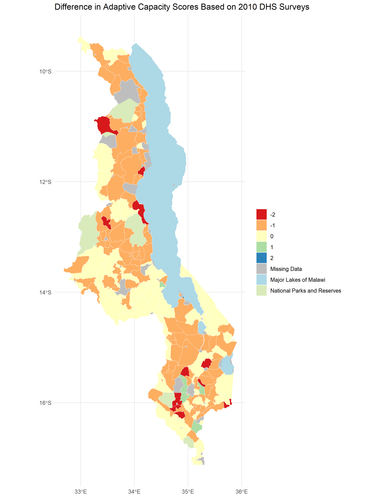

**Replication of:**
# Vulnerability modeling for sub-Saharan Africa

Original study *by* Malcomb, D. W., E. A. Weaver, and A. R. Krakowka. 2014. Vulnerability modeling for sub-Saharan Africa: An operationalized approach in Malawi. *Applied Geography* 48:17–30. DOI:[10.1016/j.apgeog.2014.01.004](https://doi.org/10.1016/j.apgeog.2014.01.004)

Replication Authors:
Madeleine Tango, Joseph Holler, Kufre Udoh, Open Source GIScience students of fall 2019 and Spring 2021

Replication Materials Available at: [https://github.com/mtango99/RP-Malcomb](https://github.com/mtango99/RP-Malcomb)

Created: `23 April 2021`
Revised: `26 April 2021`

## Abstract 

The original study is a multi-criteria analysis of vulnerability to Climate Change in Malawi, and is one of the earliest sub-national geographic models of climate change vulnerability for an African country. The study aims to be replicable, and had 40 citations in Google Scholar as of April 8, 2021. 

## Original Study Information

The study region is the country of Malawi. The spatial support of input data includes DHS survey points, Traditional Authority boundaries, and raster grids of flood risk (0.833 degree resolution) and drought exposure (0.416 degree resolution). 

The original study was published without data or code, but has detailed narrative description of the methodology. The methods used are feasible for undergraduate students to implement following completion of one introductory GIS course. The study states that its data is available for replication in 23 African countries.

### Data Description and Variables

This study used a variety of variables to determine vulnerability. Demographic and Health Survey (DHS) 
data (with GPS) was used to create an **adaptive capacity** layer, which included 
assets (livestock units, arable land, number of those sick in household in past 
12 months, wealth index score, and number of orphans in household) and access (time 
to water source, has electricity, type of cooking fuel, sex of head of household, 
owns a cell phone, owns a radio, and urban/rural). 
DHS data was collected by household clusters to protect the confidentiality of 
respondents, and GPS data was recorded at the center of each cluster ([DHS methodology](https://github.com/mtango99/RP-Malcomb/blob/main/data/metadata/DHS_GPS_Manual_English_A4_24May2013_DHSM9.pdf)). 
Then, cluster GPS positions were randomly displaced; urban clusters therefore have 0-2 km of error, 
and rural clusters have 0-5 km of error, with some up to 10 km ([DHS GPS data collection](https://github.com/mtango99/RP-Malcomb/blob/main/data/metadata/location%20accuracy.pdf)). 
Household data from DHS was aggregated to DHA clusters and then joined to traditional authorities. 
**Livelihood sensitivity** data came from 
interviews with the Malawi Vulnerability Assessment Committee, as well as data they created 
with the Famine Early Warning System Network and the US Agency for International Development. 
Livelihood sensitivity variables include food from own farm (less vulnerability), 
income from wage labor (less vulnerability), income from cash crops (more vulnerability), 
and disaster coping strategies (looking specifically at environmentally harmful practices, 
which cause vulnerability). To calculate livelihood sensitivity variables, we created a 
[spreadsheet](https://github.com/mtango99/RP-Malcomb/blob/main/data/derived/public/livelihoodData.csv) 
using the "poor" data from the Malawi Vulnerability Assessment Committee. 
For food from own farm, we divided income from cash crops by total income. 
For income from wage labor, we divided income from wage labor by total income. 
For income from cash crops, we divided income from cash crops by total income. 
For disaster coping strategy, we looked for potentially ecologically harmful 
practices, including firewood, wild food, and grass sales. We added up income from these 
practices and divided by total income. 
All of these were converted to percentages by multiplying by 100. 
Livelihood sensitivity zones were divided based on the data collected and can be found [here](https://github.com/mtango99/RP-Malcomb/blob/main/data/metadata/MW_LHZ_2009.pdf). 
A **physical exposure** layer included data from UNEP Global Resource Information
Database (GRID)-Europe with variables of estimated risk for flood hazard and exposition to drought events. 

All vulnerability variables were normalized on a scale from of 1-5. Malcomb et al. (2014) had reported 
normalizing on a scale from 0-5 (6 categories), but also stated they used quintiles (5 categories). We used quintiles on a scale of 1-5. 

According to Malcomb et al. (2014), "metathemes" (adaptive capacity, livelihood 
sensitivity, and physical exposure) and individual vulnerability variables were decided based 
on interviews with government, non-government, and development officials, as well as focus group 
interviews with villagers. Then, depending on how much Malcomb et al. (2014) thought each variable would contribute 
to vulnerability, based on their interviews with "experts," each variable was given 
particular weights (Table 1) and combined to create a vulnerability index. 
After the original normalization from 1-5, 
adaptive capacity scores were weighted and then normalized on a range of 0-20 in our 
reproduction, making the numbers similar to those in the resilience figures in Malcomb et al. (2014), 
but it was unclear how exactly they were normalized in the original paper. 

The overall vulnerability score was calculated after normalizing by weighting and adding each metatheme raster together. 

Traditional authority boundary vector layers were downloaded from DHS. 
Livelihood zones were downloaded from USAID/FEWSNET and the "MWI_adm2" layer was used. 
See the [metadata folder](https://github.com/mtango99/RP-Malcomb/tree/main/data/metadata) for more information. 

Table 1. Resilience weights. From Malcomb et al. (2014), Table 2. 

### Analytical Specification

The original study was conducted using ArcGIS and STATA, but does not state which versions of these software were used.
The replication study will use R.

**R Packages:**

**classInt:** Roger Bivand (2020). classInt: Choose Univariate Class Intervals. R
  package version 0.4-3. https://CRAN.R-project.org/package=classInt
  
**downloader:** Winston Chang (2015). downloader: Download Files over HTTP and HTTPS. R package version 0.4. https://CRAN.R-project.org/package=downloader

**dplyr:**  Hadley Wickham, Romain François, Lionel Henry and Kirill Müller (2021).
  dplyr: A Grammar of Data Manipulation. R package version 1.0.5.
  https://CRAN.R-project.org/package=dplyr

**ggplot2:** H. Wickham. ggplot2: Elegant Graphics for Data Analysis. Springer-Verlag
  New York, 2016.
  
**haven:** Hadley Wickham and Evan Miller (2020). haven: Import and Export 'SPSS',
  'Stata' and 'SAS' Files. R package version 2.3.1.
  https://CRAN.R-project.org/package=haven

**here:** Kirill Müller (2020). here: A Simpler Way to Find Your Files. R package
  version 1.0.1. https://CRAN.R-project.org/package=here
  
**readr:** Hadley Wickham and Jim Hester (2020). readr: Read Rectangular Text Data.
  R package version 1.4.0. https://CRAN.R-project.org/package=readr

**s2:** Dewey Dunnington, Edzer Pebesma and Ege Rubak (2021). s2: Spherical
  Geometry Operators Using the S2 Geometry Library. R package version
  1.0.4. https://CRAN.R-project.org/package=s2
  
**sf:** Pebesma, E., 2018. Simple Features for R: Standardized Support for
  Spatial Vector Data. The R Journal 10 (1), 439-446,
  https://doi.org/10.32614/RJ-2018-009
  
**stars:** Edzer Pebesma (2021). stars: Spatiotemporal Arrays, Raster and Vector
  Data Cubes. R package version 0.5-2.
  https://CRAN.R-project.org/package=stars
  
**rdhs:** Watson OJ, FitzJohn R and Eaton JW. rdhs: an R package to interact with
  The Demographic and Health Surveys (DHS) Program datasets Wellcome Open
  Research 2019, 4:103. (https://doi.org/10.12688/wellcomeopenres.15311.1)

## Materials and Procedure

We used Kufre Udoh & Joe Holler's [R script](assets/RP-Malcomb-jh_3_COPY.Rmd) to run this reproduction, and added in livelihood sensitivity as a group (Arielle Landau, Sanjana Roy, Steven Montilla Morantes, 
Jackson Mumper, Evan Killion, and me). 

Here is a description of our workflow: 

1. Data Preprocessing:
	1. Download traditional authorities: MWI_adm2.shp
1. Adding TA and LZ ids to DHS clusters 
1. Removing HH entries with invalid or unknown values 
1. Aggregating HH data to DHS clusters, and then joining to traditional authorities to get: ta_capacity_2010
1. Removing index and livestock values that were NA 
1. Sum of livestock by HH
1. Scale adaptive capacity fields (from DHS data) on scale of 1 - 5 to match Malcomb et al.
1. Weight capacity based on Table 2 in Malcomb et al. 
	1. Calculate capacity by summing all weighted capacity fields
1. Summarize capacity from households to traditional authorities
1. Joining mean capacities to TA polygon layer
1. Making capacity score resemble Malcomb et al.'s work (scores on range of 0-20) by multiplying capacity score by 20
1. Categorizing capacities using natural jenks methods 
1. Creating blank raster and setting extent of Malawi - CRS: 4326 
1. Reproject, clip and resampling flood risk and drought exposure rasters to new extent and cell size
	1. Uses bilinear resampling for drought to average continuous population exposure values
	1. Uses nearest neighbor resampling for flood risk to preserve integer values
	1. Removing factors and recasting them as integers
	1. Clipping TAs with LZs to remove lake
	1. Rasterizing final TA capacity layer 
1. Masking flood and drought layers 
1. Reclassify drought raster into quantiles
1. Add all RASTERs together to calculate final output:  final = (40 - geo) * 0.40 + drought * 0.20 + flood * 0.20 + livelihood sensitivity * 0.20
1. Using zonal statistics to aggregate raster to TA geometry for final calculation of vulnerability in each traditional authority 

## Replication Results

**Adaptive Capacity**

The reproduced adaptive capacity (Figure 1) was relatively similar to the original (Figure 4 of Malcomb et al. (2014)), with a Spearman's Rho of 0.7757072 (on a scale of 0-1 with 0 being dissimilar and 1 being the same). 
There were a lot more areas where the reproduction underestimated adaptive capacity than overestimated (Figure 2, Figure 3). 

[Figure 1.](assets/ac_2010.png) Results of analysis showing adaptive capacity (resilience) by traditional authority. 

[Figure 2.](assets/map_fig4compare2.png) Difference between my results and my digitization of Figure 4 of Malcomb et al. (2014) (Figure 1). Reproduction includes 197 traditional authorities. 
Spearman's Rho was 0.7757072, which is fairly close to 1 and therefore had relatively similar results between the reproduction and the original. 

[Figure 3.](assets/vulnMatrix.PNG) Matrix showing differences in resilience grouping between the digitized version of Figure 4 in Malcomb et al. (2014) (Figure 1) and my reproduction. 

**Vulnerability**

The reproduced vulnerability (Figure 4) was quite different from the original (Figure 5 of Malcomb et al. (2015)), with a Spearman's Rho 
of 0.2892254 (on a scale of 0-1 with 0 being dissimilar and 1 being the same). It also tended to 
underestimate vulnerability compared to the original study's results (Figure 5, Figure 6). 

[Figure 4.](assets/vulnerability.png) Results of analysis showing vulnerability. 

[Figure 5.](assets/map_fig5comp.png) Difference between my results and my digitization of Figure 5 of Malcomb et al. (2014) (Figure 4). 
Spearman's Rho was 0.2892254, which is not very close to 1 and therefore had quite different results between the reproduction and the original. 

[Figure 6.](assets/fig5compscatter2.PNG) Scatterplot showing similarity between my vulnerability scores and those of the original study based on a digitization of Figure 5 in Malcomb et al. (2014) (Figure 1). 
My reproduction tended to underestimate vulnerability. 

## Unplanned Deviations from the Protocol

- We had thought that variables were normalized on a 0-5 scale but realized after that Malcomb et al. (2014) mentioned they used quintiles, so we changed the scale to 1-5 by calculating 
a percent rank (between 0-1), multiplying by 4, and adding 1. We also got very different numbers for the adaptive capacity, so we multiplied by 20 to fit in the range shown in Figure 4 
in the Malcomb et al. (2014) paper. We are still not sure why our numbers were 20 times smaller than theirs. 
- We realized we needed to clean data by removing NULL values and NAs. 
- We realized we did not know how to calculate a measurement for disaster coping strategy, so we guessed using the knowledge we had. This ended up creating relatively arbitrary measures. 
- Our original workflow-- before looking at the R code provided by Joe Holler & Kufre Udoh and the data itself-- is below: 
	- Step 1: Preprocessing of Geographic Boundaries
		- 2004-2010 DHS data points (for each village surveyed): District → ***disaggregated*** → villages → ***disaggregated*** → traditional authorities 
		- DHS Households table (1 row/house) → ***field calc*** → conversion to 0-5 scale → weighted A/C score → ***join by attribute*** w/ DHS data points (village level) → ***spatial join AND group*** w/ traditional authorities (GADM adm_2) → traditional authorities w/ Capacity Score → ***Raster***
		- Drought exposure → ***rescale 0-5***
		- Flood risk → ***rescale 0-5***
		- Livelihood zones → ***copy #s from spreadsheet*** →***rescale 0-5*** →  ***Rasterize*** → ***Raster Calc*** (w/ Drought Exposure and Flood Risk Rasters) 
	- Step 2: Data Input
		- UNEP/grid Europe, Famine early warning network → ***Raster*** → ***Weight values***: All vulnerability measures were weighted (table 2) and normalized between 0 & 5 in RStudio
	- Step 3: Creating the Model of Vulnerability 
		- ***Calculate***: Household resilience = adaptive capacity + livelihood sensitivity - biophysical exposure 

## Discussion

While Malcomb et al. (2014) gave general descriptions of what they did, reproducing proved to require many guesses. The adaptive capacity aspect created relatively similar 
results to those of Malcomb et al. (2014)-- according to the digitization of one of their maps (Figure 4 in Malcomb et al. 2014)-- with a Spearman's rho of 0.7757072. While this 
is relatively high, it is still low given we think we used the same exact data and methods as they did for this part of the analysis. It is possible that our order of operations was different; 
for example, perhaps instead of aggregating and then weighting, Malcomb et al. (2014) first weighted and then aggregated. 
While there is uncertainty in the DHS data due to the way in which geographic uncertainty was intentionally added to protect confidentiality, since we used the same data this 
should not affect our Spearman's rho. It is possible that we did not aggregate in the correct order; we aggregated household data to DHS clusters and then joined to traditional 
authorities, but differences in aggregation methods may have contributed to a lower Spearman's rho. Perhaps adaptive capacity was scaled differently in the original study as well. 

The total vulnerability scores, compared to a digitization of one of their maps (Figure 5 in Malcomb et al. 2014), had a low Spearman's rho of 0.2892254. It is difficult to know how much of this difference 
came from a poor digitization vs. data acquisition and vulnerability analysis itself. It would have been really helpful if Malcomb et al. (2014) had provided raw data, derived data, and results in a format that would 
allow for comparison with a reproduction. It would have also been really helpful if they had provided more details to their analysis, and ideally, the code they used. 

Generally, our reproduction underestimated vulnerability. It is difficult to know where this underestimation came from. It could have come from the data, the analysis itself, or 
both. It would be useful to implement a Monte Carlo study, in which at every area of potential uncertainty, there could be a variety of decisions that could be made, and every 
decision would be randomized each time the model was run to see the degree to which various sources of uncertainty contribute to overall uncertainty in the code (Tate 2013). 
This would include indicator selection, scale of analysis, measurement error, data transformation, normalization, and weighting (Tate 2013). This may even include challenging the 
hierarchical model structure (using "metathemes" and subindices) (Tate 2013). 

One of the biggest uncertainties was how Malcomb et al. (2014) calculated disaster coping strategies; we used the percentage of income from potentially environmentally harmful 
sources. However, these sources of income may not actually be harmful coping strategies; it is possible to exploit resources without overexpoiting them and thus maintain 
a sustainable source of income. This disconnect between our conception of disaster coping strategies and the measurement itself is reflected by the term "construct validity." 
There also may have been disconnects between what people said was important in interviews and how these variables were interpreted due to semantic shifts in data representation (Schuurman 2008). 

While the hierarchical structure of the vulnerability model allows for a relatively simple weighting system, some variables are dependent on others. For example, if a family 
has no money, the other variables become less accessible, even if they technically are. It is also difficult to have faith in assigned percentages to vulnerability variables as that is not necessarily how the real world works, though it may be helpful in gaining a general idea 
of which areas are most and least vulnerable to stressors. There is difficulty in measuring our conception of the real world, and at each step between the real world, our concpetions, 
measurement, and analysis, there can be a disconnect that creates uncertainty (Longley et. 2008). I wonder how accurately poor Malawi locals would think this vulnerability model represents them. 
It is also difficult to check how accurate the model is, because it would require measuring harm during and after environmental or socioeconomic stressors. 

## Conclusion

This reproduction showed that there can be so many areas of uncertainty even if authors at first appeared to have reported their methods fully. 
If Malcomb et al. want their paper to be accurately applicable, not just to Malawi but to other counties in Sub-Saharan Africa, as they stated, they should be more clear about 
sources of uncertainty so that they, with the help of the larger research community, can improve their methods. To understand uncertainty better, they should also publish their code, 
and source code. A Monte Carlo analysis would also be helpful to identify which areas of uncertainty contribute most to both differences between reproductions and the original study, and the 
original study and real world outcomes.

## Acknowledgements

Thanks to Kufre Udoh and Joe Holler for providing the vast majority of the R code for this reproduction. Thanks to Vincent Falardeau for figuring out the code to make a diverging color ramp in R. 
Thanks also to the group I worked with: Arielle Landau (figuring out code), 
Sanjana Roy (understanding study methods), 
Steven Montilla Morantes (understanding study methods and sources of uncertainty), Evan Killion (understanding study methods and data sources), and Jackson Mumper (understanding study methods and helping me 
make maps in R). Thanks, Kufre, for helping me import DHS data another way when my login credentials were not working. 

## References

Longley, P. A., M. F. Goodchild, D. J. Maguire, and D. W. Rhind. 2008. Geographical information systems and science 2nd ed. Chichester: Wiley. Chapter 6: Uncertainty, pages 127-153. 

Malcomb, D. W., E. A. Weaver, and A. R. Krakowka. 2014. Vulnerability modeling for sub-Saharan Africa: An operationalized approach in Malawi. *Applied Geography* 48:17–30. DOI:10.1016/j.apgeog.2014.01.004

Schuurman, N. 2008. Database Ethnographies Using Social Science Methodologies to Enhance Data Analysis and Interpretation. *Geography Compass* 2 (5):1529–1548. 10.1111/j.1749-8198.2008.00150.x

Tate, E. 2013. Uncertainty Analysis for a Social Vulnerability Index. *Annals of the Association of American Geographers* 103 (3):526–543. doi:10.1080/00045608.2012.700616.

####  Report Template References & License

This template was developed by Peter Kedron and Joseph Holler with funding support from HEGS-2049837. This template is an adaptation of the ReScience Article Template Developed by N.P Rougier, released under a GPL version 3 license and available here: https://github.com/ReScience/template. Copyright © Nicolas Rougier and coauthors. It also draws inspiration from the pre-registration protocol of the Open Science Framework and the replication studies of Camerer et al. (2016, 2018). See https://osf.io/pfdyw/ and https://osf.io/bzm54/ 

Camerer, C. F., A. Dreber, E. Forsell, T.-H. Ho, J. Huber, M. Johannesson, M. Kirchler, J. Almenberg, A. Altmejd, T. Chan, E. Heikensten, F. Holzmeister, T. Imai, S. Isaksson, G. Nave, T. Pfeiffer, M. Razen, and H. Wu. 2016. Evaluating replicability of laboratory experiments in economics. Science 351 (6280):1433–1436. https://www.sciencemag.org/lookup/doi/10.1126/science.aaf0918. 

Camerer, C. F., A. Dreber, F. Holzmeister, T.-H. Ho, J. Huber, M. Johannesson, M. Kirchler, G. Nave, B. A. Nosek, T. Pfeiffer, A. Altmejd, N. Buttrick, T. Chan, Y. Chen, E. Forsell, A. Gampa, E. Heikensten, L. Hummer, T. Imai, S. Isaksson, D. Manfredi, J. Rose, E.-J. Wagenmakers, and H. Wu. 2018. Evaluating the replicability of social science experiments in Nature and Science between 2010 and 2015. Nature Human Behaviour 2 (9):637–644. http://www.nature.com/articles/s41562-018-0399-z.
