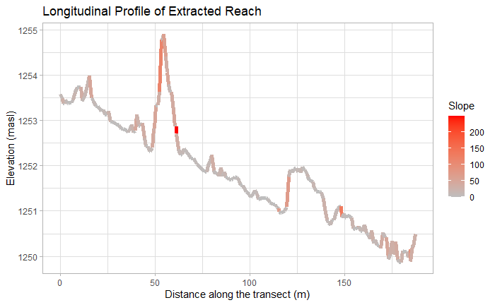
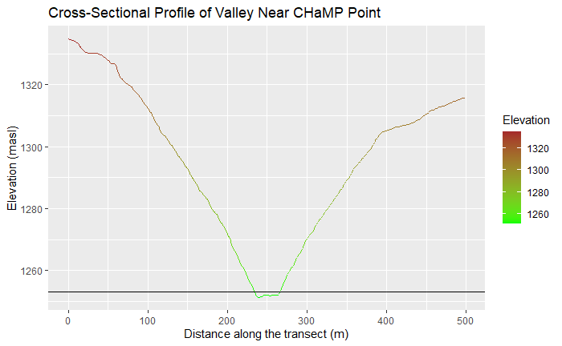
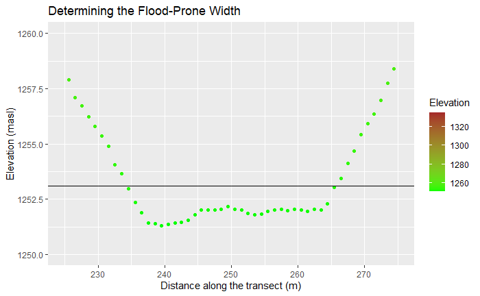
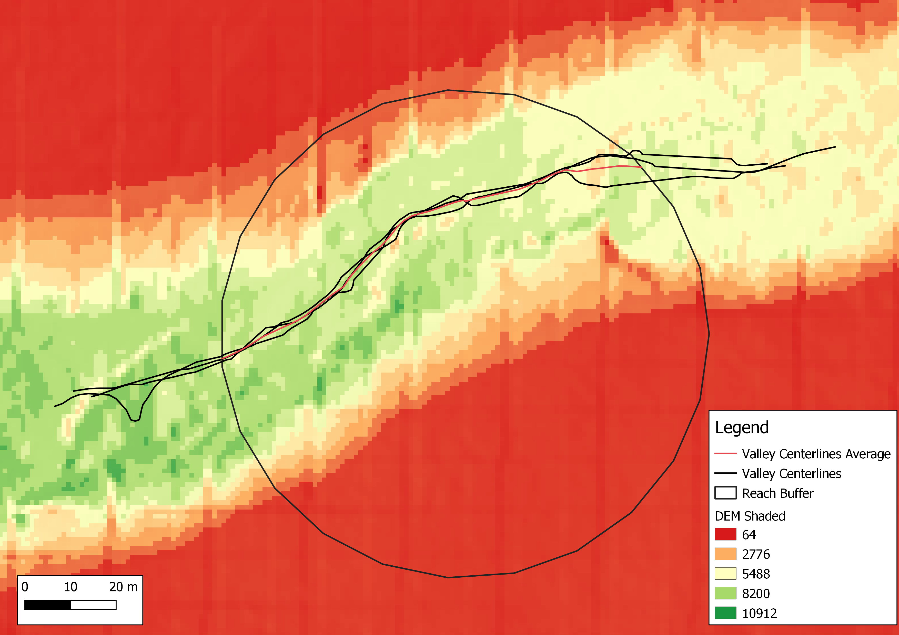
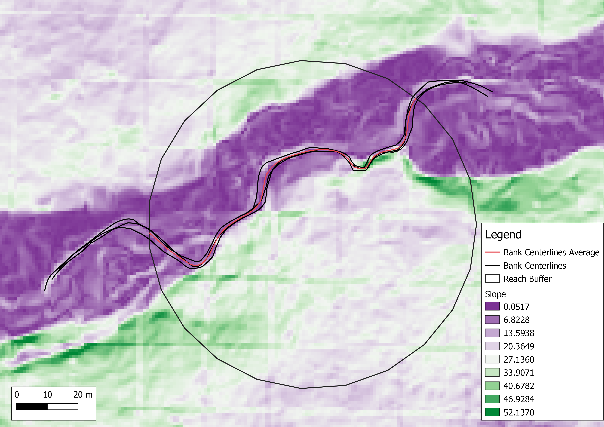

<br>

**Introduction**

The ability to classify streams consistently is important for understanding morphological change over time, flood risk, and management implications. In this project, we replicated the methods of [Kasprak et al. 2016]( https://doi.org/10.1371/journal.pone.0150293) to assess its replicability and provide a standardized framework and methodology (models, R script, and an analysis of uncertainty) for future studies that use the Rosgen classification of streams ([Rosgen 1994]( https://linkinghub.elsevier.com/retrieve/pii/0341816294900019)). 

<br>
**Methods**

The particular site I studied is at Vinegar Creek which is approximately 50 miles west of Baker City, Oregon. In the Columbia Habitat Monitoring Layer (CHaMP) point [data](https://github.com/mtango99/RE-rosgen/blob/main/data/raw/public/CHaMP_Data_MFJD.shp) (metadata [here](https://github.com/mtango99/RE-rosgen/blob/main/data/metadata/MFJD_Variables.csv)) we used, my location had SiteID ```CBW05583-404210``` and loc_id ```18```. Each person in our class studied a different point in the John Day Watershed; see a map [here](https://github.com/mtango99/RE-rosgen/blob/main/data/metadata/aoi.jpg). Each study site was 20 times the width of the bankfull width. We used bankfull width, bankfull depth, and channel material particle diameter data stored in the CHaMP point layer, and we digitized [LiDAR data](https://github.com/mtango99/RE-rosgen/blob/main/data/raw/private/JohnDayWShed.tif) (metadata [here](RE-rosgen/blob/main/data/metadata/Camp_Creek_Lidar_Report_2008.pdf)) from 2008 in GRASS 7.8.5. We followed the [instructions](https://github.com/mtango99/RE-rosgen/blob/main/procedure/protocols/1-Research_Protocol_GRASS.pdf) by Zach Hilgendorf, using two models created by Joseph Holler. The [first model](https://github.com/mtango99/RE-rosgen/blob/main/procedure/code/visualize.gxm) creates a DEM, DEM with shade, and slope layers from the watershed LiDAR layer, which we used to draw the vector digitizations of the stream banks and valleys. The [second model](https://github.com/mtango99/RE-rosgen/blob/main/procedure/code/center_line_length.gxm) creates averaged centerlines from our digitizations of bank and valley boundaries. We used stream data from the CHaMP layer as well as our digitized centerlines to classify our site according to Levels I and II of the Rosgen classification (for the classification flowchart, see the last page of this [EPA report](https://github.com/mtango99/RE-rosgen/blob/main/docs/instruction/RSC_EPA_2005.pdf)), defining the valley height (at the flood-prone height) as 2 times the bankfull depth. We then used an [R script](https://github.com/mtango99/RE-rosgen/procedure/code/2-ProfileViewer.Rmd) created by Zach Hilgendorf to graph the longitudinal and cross-sectional profiles of the stream. While the majority of these methods came from the Kasprak et al. (2016), instead of using the River Bathymetry Toolkit and CHaMP Topo Toolbar in ArcGIS, we used GRASS tools. We also used different LiDAR data and did not have the benefit of using ground-based assessments. 

<br>
**Discussion**

While my analysis found my site’s Rosgen classification as C4c-, Kasprak et al. (2016) classified it as B4. The C4c- classifications indicates less entrenchment and a less steep slope than B4. Interestingly, the CHaMP data labeled this site as Rosgen classification B3C, which has larger channel material (cobble as opposed to gravel) and a steeper slope. 

Differences between my classification and the CHaMP data and Kasprak et al. (2016) classifications could be attributed to the fact that because we did not use ground-based assessments, we were using DEM, hillshade, and slope layers to draw vector digitizations of the stream banks and valley boundaries. It was often difficult to read these layers and despite drawing each line three times and using their averages, there was a great deal of human error in drawing the lines. Moreover, because we were zoomed in to a 1:1500 map scale, it was difficult to account for the larger context of the river. It is possible that parts of the bank centerlines were actually up on the bank sides instead, though because we used average and maximum values for ratios, these would likely not affect the ratios used for classifications, other than slope potentially. There may also be errors within the LiDAR data itself due to the visible lines through the layer and the fact that LiDAR can often sense obstructions like bridges or vegetation as opposed to the ground. Rivers often change over time, so that is another possible reason for the discrepancy in classification. 

When comparing to the Kasprak et al. (2016) study, the width/depth ratio and channel material are the same because they rely on the same CHaMP data; however, the entrenchment ratio, sinuosity, and slope would be different because different LiDAR datasets were used, with different bank and valley digitizations. 

<br>
**Conclusions**

The fact that my methods did not produce the same classification as Kasprak et al. (2016) or the CHaMP data indicates the value of ground-based classification; however, with more accurate digitization, it may be possible to not need as much ground field work in future study methods. The sources of error and uncertainty outlined above will help to perfect methodologies toward one that is accurate and widely used, allowing for the standardization of how we use the Rosgen classification. Having publicly available models helps with consistency and allows for faster improvement because one does not need to rebuild an analysis every time a change is necessary, and can run various methods or data quickly to compare. Once we can achieve using only remote sensing data to accurately reproduce the results of studies that used ground-based observations, we can have more confidence in analyses that do not require ground-based observations, saving time and resources while maintaining accuracy. 

<br>
**Tables & Figures**

<br>
Table 1. Site Measurements

| Variable | Value | Source |
| :-: | :-: | :-: |
| Bankfull Width (avg) | 5.3578 m | CHaMP: “BfWdth_Avg” |
| Bankfull Depth (max) | 0.8979 m | CHaMP: “DpthBF_Max” |
| Bankfull Depth (avg) | 0.1975 m | CHaMP: “DpthBF_Avg” |
| Valley Width | 32 m | R code using terrain cross-section at floodplain height (valley depth) |
| Valley Depth | 1.7958 m | 2x Bankfull Depth (max) |
| Stream/River Length | 126.24 m | GRASS model output: banks centerline |
| Valley Length | 104.81 m | GRASS model output: valleys centerline |
| Median Channel Material Particle Diameter | 37 mm | CHaMP: “SubD50” |

<br>
Table 2. Rosgen Level I Classification

| Criteria | Value |
| :-: | :-: |
| Entrenchment Ratio | 5.9726 |
| Width / Depth Ratio | 27.128 |
| Sinuosity | 1.2045 |
| Level I Stream Type | C |

<br>
Table 3. Rosgen Level II Classification

| Criteria | Value |
| :-: | :-: |
| Slope | 0.005729 |
| Channel Material | gravel |
| Level II Stream Type | C4c- |

<br>


[Figure 1.](assets/longitProfile_elevslope.jpg) Longitudinal profile of stream site, showing elevation and slope. 

<br>

 
[Figure 2.](assets/crossProfile.jpg) Cross-sectional profile of stream site by elevation. 

<br>


[Figure 3.](assets/crossProfileFloodProne.jpg) Cross-sectional profile of stream site, zoomed into flood-prone area.  

<br>

 
[Figure 4.](assets/valleysdemShade.png) Valley centerlines and DEM with shading. 

<br>


[Figure 5.](assets/banksSlope.png) Banks centerlines and slope layer. 

<br>
**Acknowledgements**

Special thanks to Professor Joseph Holler and Zach Hilgendorf for providing materials and guidance for this project, as well as my fellow students in GEOG0323, particularly Steven Montilla Morantes, Sanjana Roy, Maja Cannavo, and Jackson Mumper, with whom I worked the closest.
