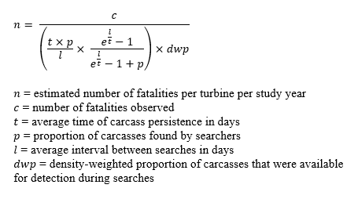
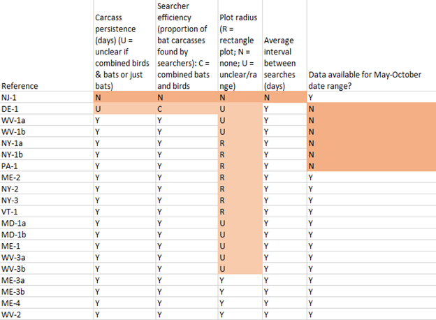
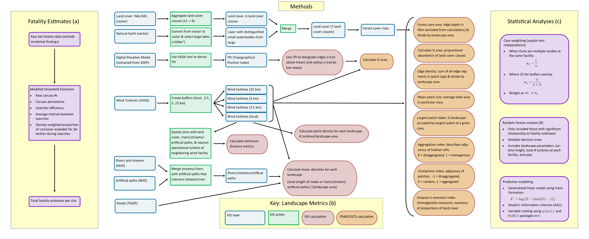
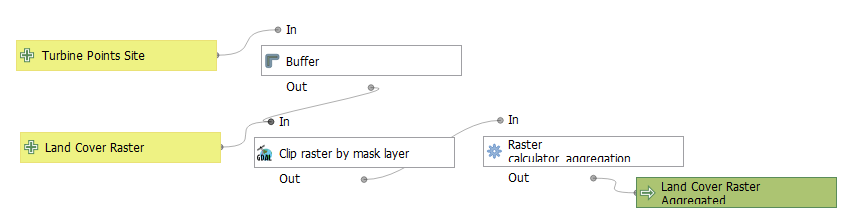
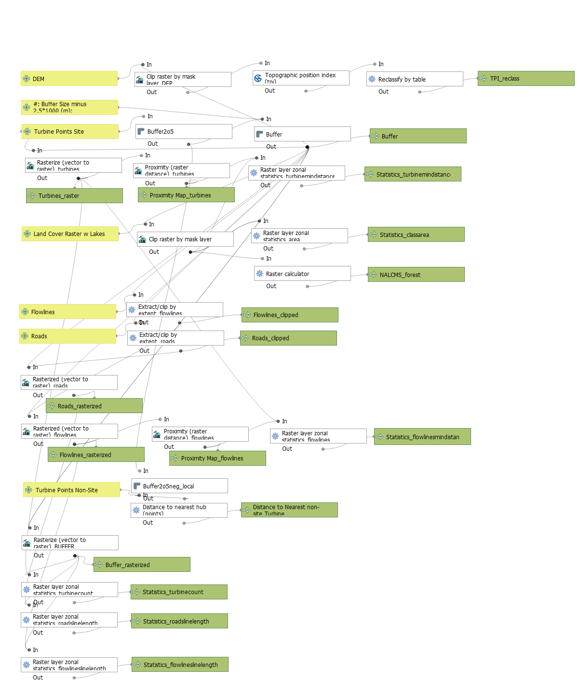

 
### Integrative Thesis: Environmental Studies, Geography, Biology (Fall 2020-Spring 2021) ###

**Advisors: Joseph Holler & David Allen**

 
**Abstract**

With the expansion of wind energy as an alternative to fossil fuel use, it is important that we have the tools necessary to analyze ecological impacts. While geographic information studies (GIS) has many tools for this analysis, the lack of reproducibility in the field will lead to both decreased accuracy of results and slow down knowledge gain during a time in which research speed could prevent extinctions. In this integrative geography and biology thesis, I study the reproducibility of a geographical analysis to better understand barriers to its reproduction. The study, conducted by consulting group DNV GL for the Wind Wildlife Research Fund, analyzes the relationship between tree-roosting bat fatalities and landscape features at on-shore wind farms in the northeast United States (Peters et al. 2020). By making models and R scripts that reproduce the methods of this study, I improve its future reproducibility while analyzing the ways in which both the bat fatality studies used to provide data for the Peters et al. (2020) study and the study itself could have been reported better for clarity and transparency with regards to methods, data, and sources of uncertainty. The models and R scripts can be applied at various spatial scales to calculate landscape metrics (i.e. connectivity, percent area of land cover, forest core area, etc.) and determine which are most correlated with hoary bat, eastern red bat, and silver-haired bat fatalities in a particular region. Methods, models, and R scripts are publicly available and could be applied to other spatial correlation studies as well. 

 
**Bat Fatality Reporting**

First I went through studies in the [AWWIC database](https://awwic.nacse.org/) to see if they could be normalized using a modified Shoenfeld Estimator. 

The modified Shoenfeld Estimator is based on the Shoenfeld Estimator ([Shoenfeld 2004](https://nationalwind.org/wp-content/uploads/2013/05/Shoenfeld-2004-Suggestions-Regarding-Avian-Mortality-Extrapolation.pdf)) with an added *dwp* variable (Peters et al. 2020). It takes into account a variety of parameters to create estimates of total fatalities from raw fatality counts, which then we can compare across wind turbine sites. 

Unfortunately, a lot of studies did not report enough information for their raw data to be converted into total estimates. (See full audit [here.](https://github.com/mtango99/thesis/blob/main/results/FatalitiesStudyAudit.xlsx))

 
**Models & R Scripts**

I made some models and R scripts that reproduce the methods of the [Peters et al. (2020)](https://tethys.pnnl.gov/sites/default/files/publications/Landscape_Factors_and_Migratory_Tree_Bats_0.pdf) paper. Instructions and details for using the models and R scripts can be found [here](https://github.com/mtango99/thesis/blob/main/procedure/protocols/Model_InfoSheet.docx). 

Here is a workflow of Peters et al. (2020)'s methods.

[Link to image.](assets/Workflow_Figure3.png) Workflow of Peters et al. methods, visualized by M. Tango. Panel a: fatality estimates. Panel b: landscape metrics. Panel c: statistical analyses. 

Here is the [model](https://github.com/mtango99/thesis/blob/main/procedure/code/preprocessinglandcover.model3) I made to preprocess the land cover data (it consolidates similar classes). 

[Link to image.](assets/Model_landcoverpreprocessing_img.png) Preprocessing model. QGIS model: graphical modeler visualization. QGIS 3.16.4. 

Here is the [model](https://github.com/mtango99/thesis/blob/main/procedure/code/thesismodel.model3) that outputs some landscape metrics. 

[Link to image.](assets/Model_img.png) QGIS model: graphical modeler visualization. QGIS 3.16.4. 

Here is an [R script](https://github.com/mtango99/thesis/blob/main/procedure/code/Thesis_R2.R) that outputs the rest of the landscape metrics. 

Here is an [excel file](https://github.com/mtango99/thesis/blob/main/results/FinalCalculations5.xlsx) with all of the landscape metrics I got for the Beech Ridge, WV (WV-2) turbine site. 

Here is the [statistics R script](https://github.com/mtango99/thesis/blob/main/procedure/code/rf_example.R) that uses Random Forests, GLMs, and AICc to show which of the landscape metrics are most associated with bat fatalities. Because there was not enough information to put together bat fatality estimates, I used a sample script of [random data](https://github.com/mtango99/thesis/blob/main/data/RandomForests_randomData2.csv) (this also does not have all possible variables included). 

 
**Acknowledgements**

Thanks to my thesis advisors, Professor Joseph Holler and Professor David Allen for their ideas, support, and edits throughout this project. Thanks especially to Professor Holler helping me think about reproducibility as well as his QGIS knowledge, and to Professor Allen for helping me with statistics and R code. 

