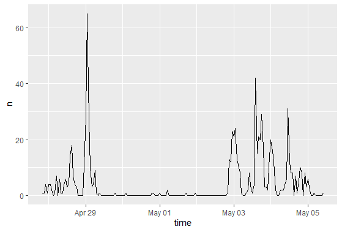
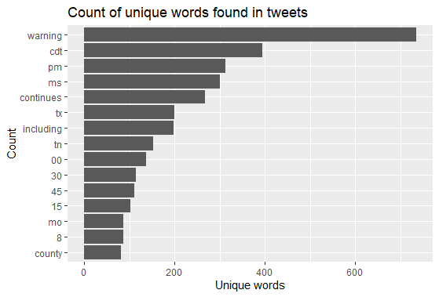
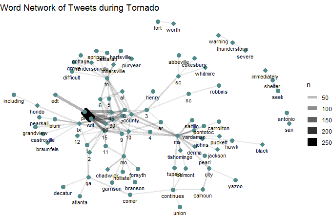
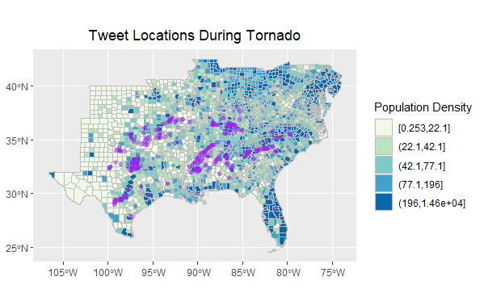
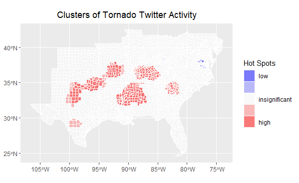

**Replication of:**
# Spatial, temporal and content analysis of Twitter data

Original study *by* Wang, Z., X. Ye, and M. H. Tsou. 2016. Spatial, temporal, and content analysis of Twitter for wildfire hazards. *Natural Hazards* 83 (1):523–540. DOI:[10.1007/s11069-016-2329-6](https://doi.org/10.1007/s11069-016-2329-6). 
and
First replication study by Holler, J. 2021 (in preparation). Hurricane Dorian vs Sharpie Pen: an empirical test of social amplification of risk on social media.

Replication Author: 
Maddie Tango

Replication Materials Available at: [https://github.com/mtango99/RE-Dorian](https://github.com/mtango99/RE-Dorian)

Created: `05 May 2020`
Revised: `25 May 2020`

## Abstract 

Why study the spatial distribution of Twitter data? 

Wang et al. (2016) analyzed Twitter data for wildfires in California, finding that the social media data can track wildfires over space and time, 
and showed that news media and local authority were dominant in the wildfire retweet network. 

Holler (2021) is studying Twitter data for Hurricane Dorian on the Atlantic coast, finding that in spite of tending news and social media content 
regarding a false narrative of risk, original tweets still clustered significantly along the real hurricane track, and only along the hurricane track.

Reproducing and replicating spatial research of Wang et al. (2016) and Holler (2021) is important for understanding how we may analyze large datasets 
such as Twitter tweets and retweets, using keywords and R packages for visualization. 

In this replication study, I will study the spatial and temporal distribution of tweets with the words "tornado," "tornado warning," and "debris" 500 miles 
from Alabama coordinates (32,-87) between April 27 - May 5, 2021. 

## Original Study Information

Wang et al. (2016) analyzed the spatial and temporal patterns of wildfire-related tweets between May 13, 2014 and May 22, 2014 using the Twitter search API.

First, Wang et al. (2016) selected for tweets and retweets with the words “fire” or “wildfire.” These tweets could be analyzed based on space, time, content, and network. 
They mapped the locations of the tweets using centroids of each census block to normalize by population (Figure 3). They also graphed the frequency of tweets over time, 
and the frequency of the top 10 terms used (Figure 1, Figure 7).

Wang et al. then did a second search, searching by specific wildlife (San Marcos and Bernardo), and filtering out tweets and retweets without the words “fire” 
or “wildfire” after. This was used to identify ignition locations of the fires so that they could then analyze the influence of distance from the ignition site 
on Tweet responses. They removed URLs and stop words (words with little meaning), and combined words that meant the same thing. They created a map for each fire, 
using a dual kernel density estimation (Dual KDE) and again normalizing by census block population (Figure 4, Figure 5). They also graphed the frequency of tweets 
over time (Figure 2).

They then created a figure of the retweet network using the “k-means clustering method” with the R package “igraph” and published term clusters in the form of a table 
for “wildfire” tweets (Figure 10, Table 3). This network analysis helped to determine information gatekeepers, using the indegree (times they’ve been retweeted by others) 
and outdegree (times they have retweeted others) for each node (user).

Holler (2021) loosely replicated the methods of Wang et al (2016) for the case of Hurricane Dorian's landfall on the U.S. mainland during the 2019 Atlantic Hurricane season. 
Data was based on Twitter Search API queries. 

Holler modified Wang et al.'s methods by not searching for retweets for network analysis, focusing instead on original Tweet content with keywords hurricane, 
Dorian, or sharpiegate (a trending hashtag referring to the storm). Holler used a buffer size of 1000 mi of coordinates (32,-78) off the coast of South Carolina and used 
data from September 3-11, 2019.  
Holler modified the methodology for normalizing tweet data by creating a normalized Tweet 
difference index and extended the methodology to test for spatial cluserting with the local Getis-Ord statistic. The study tested a hypothesis that false narratives 
of hurricane risk promulgated at the highest levels of the United States government would significantly distort the geographic distribution of Twitter activity related 
to the hurricane and its impacts, finding that original Twitter data still clustered only in the affected areas of the Atlantic coast in spite of false narratives about 
risk of a westward track through Alabama.

Wang et al. (2016) conducted their study using the `tm` and `igraph` packages in `R 3.1.2` but did not state if any other software were used. 
The replication study by Holler (2021) used R, including the `rtweet`, `rehydratoR`, `igraph`, `sf`, and `spdep` packages for analysis.

## Materials and Procedure

I used the code provided by Holler (2021) and changed the Twitter search parameters to the words "tornado," "tornado warning," and "debris" within 500 mi of 
Alabama coordinates (32,-87). 
Data were downloaded on May 5, 2021 and thus included tweets from between April 27 - May 5, 2021. 
8452 results came up out of a total dataset for that area. 
Of these 8452 tweets, only 752 had GPS coordinates. I will refer to these 752 tweets as "filtered tweets."
Without specified keywords, 8914 tweets were found for these search parameters, with coordinates. 
The search IDs for the tweets with the keywords can be found [here](https://github.com/mtango99/RE-Dorian/blob/main/data/derived/public/tweetfiltids.txt), 
and search IDs for the tweets without specifying keywords can be found [here](https://github.com/mtango99/RE-Dorian/blob/main/data/derived/public/tweettotalfiltids.txt).

Tweets were normalized based on population per county; the `tidycensus` package was used to draw county populations from the US Census. 
A "normalized difference tweet index" (ndti) as developed by Holler (2021) was used to gauge how many tweets were about the tornadoes in relation to baseline tweet activity. 

The three sets of code used for this analysis can be found [here](https://github.com/mtango99/RE-Dorian/blob/main/procedure/code/01-search_dorianPROJ.R), [here](https://github.com/mtango99/RE-Dorian/blob/main/procedure/code/02-analyze-dorianPROJ.R), and [here](https://github.com/mtango99/RE-Dorian/blob/main/procedure/code/04-spatial-clusteringPROJ.r). 

## Replication Results

[Figure 1.](assets/tweetsByHourAL.png) Temporal analysis graph. Graphs frequency of filtered tweets with keywords over time. 
There was a large spike in tweets with keywords "tornado," "tornado warning," and "debris" on April 29, then very few tweets until May 3-May 5, when tweets were more common. 

 

[Figure 2.](assets/tweetWordsAL.png) Tweet word content frequency graph. Words do not include "stop words" (words like "the" and "and" with no relevant meaning) or the keywords used in the search. 
It makes sense that "warning" had the most given I used keywords "tornado" and "tornado warning," but not "warning." Time-related words (cdt, pm, tn, 00, 15, 30, 45) and location-related words (states abbreviations like ms, tx, and county) were most common. 

 

[Figure 3.](assets/tweetsWordPairsAL6.png) Tweet word pairs. Shows a network analysis of filtered tweets based on their relationship in the tweet/retweet network. Time-related and location-related words are most clumped, with many numbers and county names. 

 

[Figure 4.](assets/tweetLocationsAL.png) Tweet locations map. Shows filtered tweets (500 mi from (32,-87) coordinates). Tweets track tornado activity. 

 

[Figure 5.](assets/tweetActivityMapTornado.png) Hotspots map. Created using an Ord G* statistic. Tweets track tornado activity. 

## Unplanned Deviations from the Protocol

For the filtered tweet network (Figure 3), I changed "n" from 25 to 6 so that more word pairs would show up. 
Other than that, I followed Joe Holler's scripts, which itself deviated a bit from the Wang et al. (2016) methodology given only one API search was conducted (as opposed to 2 for Wang et al. (2016)). We used the same data to track the locations of the tornadoes and analyze spatially as well. 

## Discussion

My findings confirm patterns observed by Wang et al. (2016), that tweets 
can characterize a natural disaster over space and time. Particularly for this analysis, where I only 
used tweets with GPS coordinates, it makes sense that those more connected to the 
natural disaster would feel more comfortable with sharing GPS coordinates, though 
perhaps out of necessity. Holler (2021) found similar results, that tweets tracked Hurricane Dorian over space. 

Due to the lack of news... (wiki page???)
However, it is difficult to know in my case if the (tracking one tornado or multiple at a time??)
Future should add average date to each patch??
Smaller extent than Dorian

## Conclusion

While using tweet data can have ethical implications due to privacy concerns (Crawford & Finn 2014), it can also be useful for better understanding 
how the general public views and experiences news, natural disasters, and any other trending topics on Twitter. Future studies should consider best practices for using 
personal data. 

## References

Crawford, K., and M. Finn. 2014. The limits of crisis data: analytical and ethical challenges of using social and mobile data to understand disasters. *GeoJournal* 80 (4):491–502. DOI:10.1007/s10708-014-9597-z

####  Report Template References & License

This template was developed by Peter Kedron and Joseph Holler with funding support from HEGS-2049837. This template is an adaptation of the ReScience Article Template Developed by N.P Rougier, released under a GPL version 3 license and available here: https://github.com/ReScience/template. Copyright © Nicolas Rougier and coauthors. It also draws inspiration from the pre-registration protocol of the Open Science Framework and the replication studies of Camerer et al. (2016, 2018). See https://osf.io/pfdyw/ and https://osf.io/bzm54/ 

Camerer, C. F., A. Dreber, E. Forsell, T.-H. Ho, J. Huber, M. Johannesson, M. Kirchler, J. Almenberg, A. Altmejd, T. Chan, E. Heikensten, F. Holzmeister, T. Imai, S. Isaksson, G. Nave, T. Pfeiffer, M. Razen, and H. Wu. 2016. Evaluating replicability of laboratory experiments in economics. Science 351 (6280):1433–1436. https://www.sciencemag.org/lookup/doi/10.1126/science.aaf0918. 

Camerer, C. F., A. Dreber, F. Holzmeister, T.-H. Ho, J. Huber, M. Johannesson, M. Kirchler, G. Nave, B. A. Nosek, T. Pfeiffer, A. Altmejd, N. Buttrick, T. Chan, Y. Chen, E. Forsell, A. Gampa, E. Heikensten, L. Hummer, T. Imai, S. Isaksson, D. Manfredi, J. Rose, E.-J. Wagenmakers, and H. Wu. 2018. Evaluating the replicability of social science experiments in Nature and Science between 2010 and 2015. Nature Human Behaviour 2 (9):637–644. http://www.nature.com/articles/s41562-018-0399-z.
